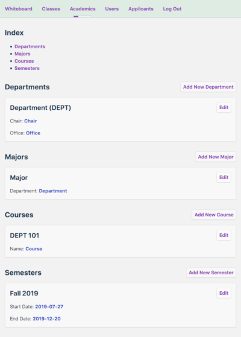
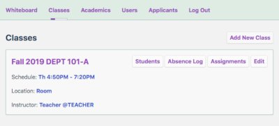
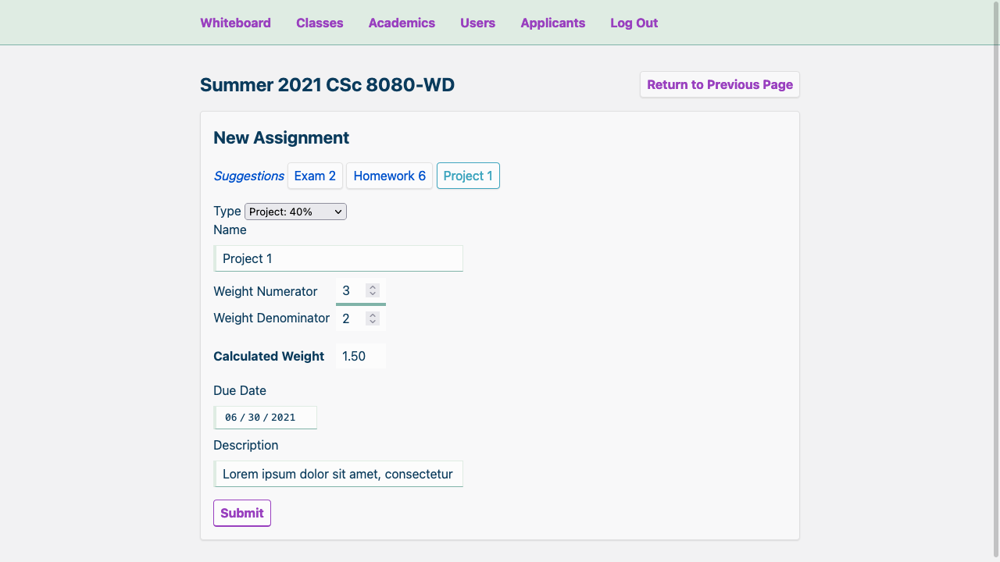

# Whiteboard

**Whiteboard** is a web-based gradebook and attendance tracker for teachers and students.


<span style="vertical-align: top;"></span>



## Prerequisites

- Python >= 3.6
- Flask >= 1.1.1
- Flask-Migrate >= 2.5.2
- Flask-Login >= 0.4.1
- Flask-SQLAlchemy >= 2.4.0
- Flask-WTF >= 0.14.2

## Starting the Development Server

Enter the following commands in a terminal:

```bash
export FLASK_APP=whiteboard
export FLASK_ENV=development
# flask db upgrade # Run this to initialize the database.
flask run
```

On Windows, use `set` instead of `export`.

To create a new superuser, run the command:

```bash
python createsuperuser.py
```

## Migrations

Whenever the database models are changed, run the following commands:

```bash
flask db migrate
flask db upgrade
```

For more information, run the command:

```bash
flask db --help
```

## Team

- Kangming Deng
- Munif Nagi
- Mozammel Neel
